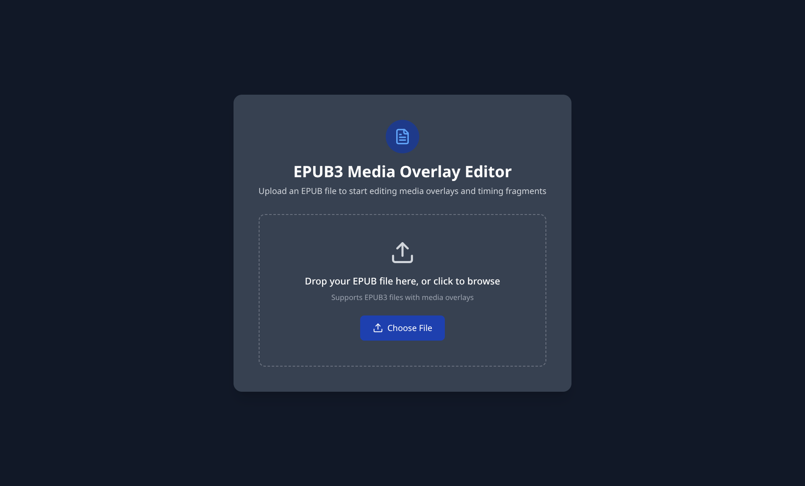
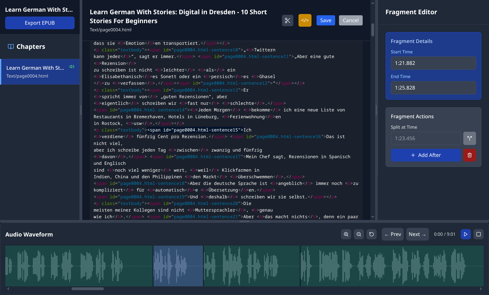

# EPUB Media Overlay Editor (epub-moe)

A React-based tool for fine-tuning synchronized text and audio in EPUB files (aka "TalkingBooks").

## What This Is

I built epub-moe because I needed surgical precision when creating German language learning books with synchronized audio. Existing tools like [Storyteller](https://gitlab.com/storyteller-platform/storyteller) are excellent for initial auto-synchronization, but sometimes you need more granual control, especially for educational content where precise timing matters.

> [!NOTE]
> This tool is designed for **fine-tuning existing media overlays**, not creating them from scratch.


## What This Does Well

- **Drag and drop audio regions**: Move boundaries directly on the waveform until timing is pixel-perfect
- **Text-to-audio linking**: Select text fragments to instantly hear their corresponding audio and vice versa  
- **Fine-tune fragments**: Edit timing values precisely, delete unwanted fragments directly from the GUI
- **Inline HTML editing**: Make quick adjustments to highlight placement without leaving the app
- **Fragment splitting**: Break up sprawling sentences into digestible chunks
- **EPUB-centric workflow**: Load EPUB, edit, export EPUB - no format conversion hell and no audio re-encoding (!)

## What This Doesn't Do

- **Auto-synchronization**: Use [Storyteller](https://gitlab.com/storyteller-platform/storyteller) or similar tools first
- **EPUB creation**: Assumes you already have an EPUB with basic media overlay structure
- **Full-featured EPUB editing**: This is a personal tool that solved my specific problem. It is narrowly focused by design. For complete EPUB authoring/editing I recommend using [Sigil](https://sigil-ebook.com/)
- **Enterprise features**: No user management, cloud sync, collaboration, etc.

## Built By

My name is André Klein. I'm an independent publisher of German learning materials at [LearnOutLive](https://learnoutlive.com), including EPUB "TalkingBooks" with media overlays. This tool exists because I needed something that could fine-tune media overlays with precision, and existing solutions weren't cutting it. It's built for my specific workflow, but maybe it'll work for yours too.

[Read the full backstory here.](https://andreklein.net/why-i-built-my-own-epub-media-overlay-editor/)

## Compatibility & Requirements

Epub-moe has been tested with "TalkingBooks" that Storyteller Version 1.3.6 generates. I've also tested it with EPUB exports from other tools like Tobi.


> [!IMPORTANT]
> For the audio timing to be perfect, it is recommended to use constant bit rate MP3s. When using MP3s with variable bit rate, there is a drift over time due to how web audio libraries handle VBR files - the waveform display becomes increasingly inaccurate as you move further into the audio.

## Installation & Setup

```bash
git clone https://github.com/burninc0de/epub-moe
cd epub-moe
npm install
npm run dev
```

Open [http://localhost:5173](http://localhost:5173) in your browser.

## Usage

1. **Load EPUB**: Drag and drop an EPUB file with existing media overlay structure
2. **Select chapter**: Choose the chapter you want to edit from the left panel
3. **Fine-tune timing**: Click on text fragments or audio regions to adjust boundaries
4. **Edit if needed**: Use the HTML editor for quick text adjustments  
5. **Export**: Download the updated EPUB with your changes

### Toolbar Features

- **Scissors icon**: When toggled, allows you to split text fragments at desired points. This will automatically split the corresponding audio for that fragment as well.
- **Display toggle**: Switch between line display (fragments appear as separate lines for easier parsing) and flow text (fragments flow naturally with text)
- **Code icon**: Toggle HTML source editing mode for direct markup adjustments

### Waveform Controls

- **Play/Pause**: Click the play button or press **Spacebar** to toggle audio playback
- **Next/Previous**: Navigate between audio fragments with the arrow buttons
- **Red timer icon "Apply Timer Offset"**: Located in the bottom waveform viewer panel, allows you to shift all fragments by desired time intervals to correct timing offsets across the entire chapter.ing synchronized text and audio in EPUB files (aka "TalkingBooks").
- **Red timer icon "Apply Timer Offset"**: Located in the bottom waveform viewer panel, allows you to shift all fragments by desired time intervals to correct timing offsets across the entire chapter.

## Screenshots

### Upload Screen


### Main Workspace


### HTML Editor


## Known Limitations

- Built for my specific workflow - your mileage may vary
- Minimal error handling (it works for most EPUBs, can't promise it'll work for yours)
- No undo functionality (export often!)
- Single-user, local-only (no cloud features)

## Contributing

This project exists because I needed it to work. If you find it useful and want to improve it, great! But please understand:

- I'm a writer first, developer second
- I can't commit to ongoing maintenance or support
- Pull requests welcome, but no promises on review timelines
- Issues are fine, but "it doesn't work with my EPUB" might not get fixed

## Technical Stack

- React
- WaveSurfer.js for audio waveforms
- JSZip for EPUB parsing
- Standard web APIs

## License

MIT - Use it however you want. If it helps you create better accessible content, even better.

## Acknowledgments

- [Storyteller](https://gitlab.com/storyteller-platform/storyteller) by Shane Friedman - excellent auto-sync tool
- The broader EPUB community dedicated to working on everything SMIL/Media Overlays
- Everyone building open source tools that made this possible

---

*"There are dozens of us who care about EPUB media overlays. Dozens!"*
